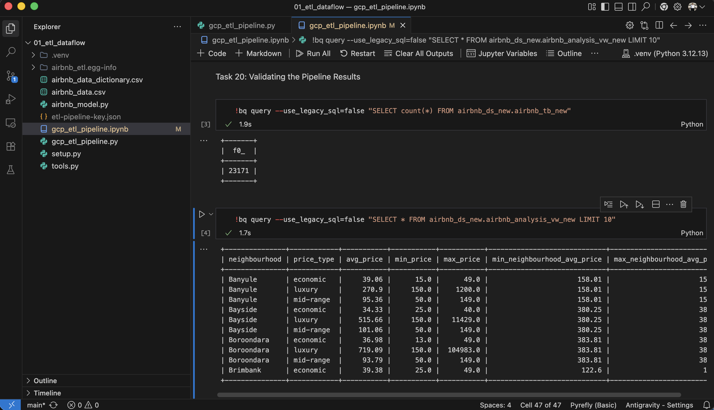
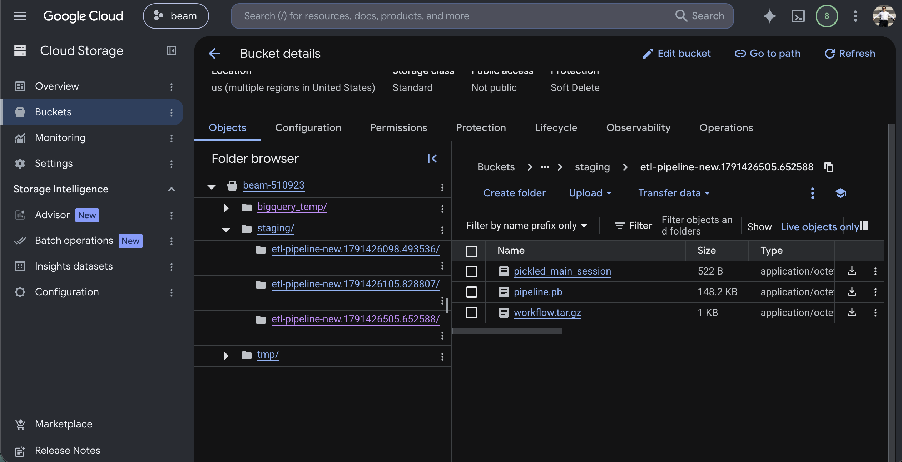
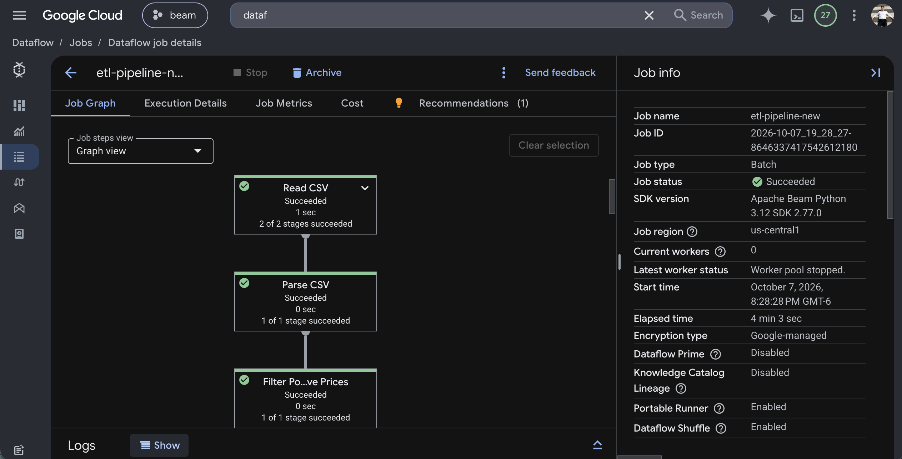
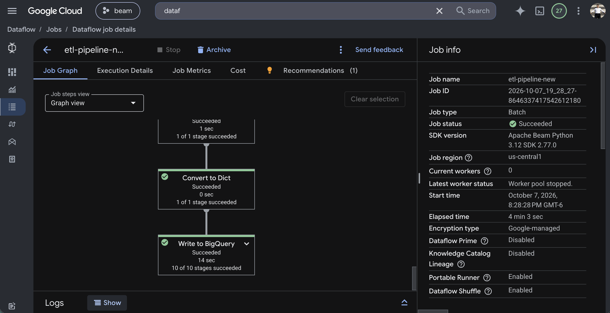
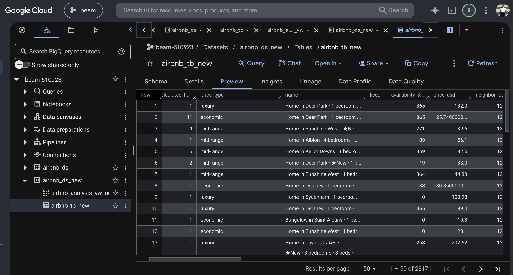

# Pipeline ETL de Airbnb con Apache Beam y Google Cloud Dataflow

Pipeline ETL que lee un CSV de anuncios de Airbnb (Melbourne) desde Cloud Storage, lo valida, limpia y enriquece con Apache Beam, lo ejecuta en Google Cloud Dataflow y carga el resultado en BigQuery, donde una vista resume los precios por barrio y categoría.

```
Cloud Storage (airbnb_data.csv)
        │
        ▼
Apache Beam en Dataflow ── validar ─ deduplicar ─ limpiar ─ enriquecer ─ promedio por barrio
        │
        ▼
BigQuery (airbnb_ds_new.airbnb_tb_new) ──► vista airbnb_analysis_vw_new
```

## Contenido

| Archivo | Descripción |
|---|---|
| `gcp_etl_pipeline.py` | Pipeline completo que corre en Dataflow (`DataflowRunner`), crea el dataset, carga la tabla y crea la vista. |
| `gcp_etl_pipeline.ipynb` | El mismo pipeline paso a paso en Jupyter, ejecutado localmente con `DirectRunner`. |
| `airbnb_model.py` | `AirbnbData`, el `NamedTuple` que representa cada fila. Vive en su propio módulo para que los workers de Dataflow puedan importarlo. |
| `setup.py` | Empaqueta `airbnb_model.py` para que Dataflow lo instale en sus workers. |
| `airbnb_data.csv` | Datos de entrada: 18 columnas por anuncio. |
| `airbnb_data_dictionary.csv` | Diccionario de datos de las columnas. |
| `screenshots/` | Capturas de la ejecución. |

## Qué hace el pipeline

1. **Lectura** del CSV desde `gs://beam-510923/airbnb_data.csv`, omitiendo el encabezado, y parseo de cada línea a `AirbnbData`.
2. **Validación**: descarta precios negativos, coordenadas fuera de rango y anuncios sin `host_id`.
3. **Deduplicación** con `beam.Distinct()`.
4. **Limpieza**: reemplaza comas en `name` por `_` e imputa valores vacíos (`neighbourhood` → `Not Available`; `availability_365`, `reviews_per_month` y `number_of_reviews_ltm` → `0`).
5. **Enriquecimiento**:
   - `price_type`: `economic` (< 50), `mid-range` (50–149) o `luxury` (≥ 150).
   - `price_usd`: precio convertido a dólares (`price × 0.66`).
   - `lr_year`, `lr_month`, `lr_day`: componentes de `last_review`.
6. **Agregación**: precio promedio por barrio (`GroupByKey`), agregado a cada fila como `neighborhood_avg_price` mediante un side input.
7. **Carga** en BigQuery con esquema autodetectado y `WRITE_TRUNCATE`, de modo que reejecutar reemplaza la tabla.
8. **Vista** `airbnb_analysis_vw_new` con precio promedio, mínimo y máximo por barrio y `price_type`.

Resultado: **23,171 filas** cargadas en `beam-510923.airbnb_ds_new.airbnb_tb_new`.

## Cómo ejecutarlo

### Requisitos

- Python 3.12 (Apache Beam 2.77 todavía no es compatible con 3.14).
- Proyecto de Google Cloud con las APIs de Dataflow, Compute Engine, Cloud Storage y BigQuery habilitadas.
- Una cuenta de servicio con `roles/dataflow.admin`, `roles/dataflow.worker`, `roles/storage.admin` y `roles/bigquery.admin`, y `roles/iam.serviceAccountUser` sobre sí misma.

### Entorno

```bash
uv venv --python 3.12
uv pip install --python .venv/bin/python "apache-beam[gcp,interactive]" ipykernel build setuptools
```

### Credenciales

Opción recomendada, sin archivo de llave (suplantando a la cuenta de servicio):

```bash
gcloud auth application-default login --impersonate-service-account=SERVICE_ACCOUNT_EMAIL
```

Opción con llave JSON: guárdala como `etl-pipeline-key.json` en esta carpeta (está en `.gitignore`) y apunta `GOOGLE_APPLICATION_CREDENTIALS` a ella, como hace la línea correspondiente en `gcp_etl_pipeline.py`.

### Ejecutar en Dataflow

```bash
.venv/bin/python gcp_etl_pipeline.py
```

El job tarda unos 4–5 minutos. Se puede seguir en la consola de Google Cloud, en **Dataflow → Jobs**.

### Ejecutar el notebook

Abre `gcp_etl_pipeline.ipynb` con el kernel de `.venv` y ejecuta las celdas en orden. El notebook usa `DirectRunner`, así que el procesamiento corre en la máquina local; solo la lectura y la escritura usan Cloud Storage y BigQuery.

## Problemas encontrados y cómo se resolvieron

| Síntoma | Causa | Solución |
|---|---|---|
| `Key creation is not allowed on this service account` | La organización tiene activa la política `iam.disableServiceAccountKeyCreation`. | Suplantar la cuenta de servicio con Application Default Credentials o, si se necesita la llave, desactivar la política solo en el proyecto con un usuario que tenga `roles/orgpolicy.policyAdmin`. |
| `Anonymous credentials cannot be refreshed` | `GOOGLE_APPLICATION_CREDENTIALS` apuntaba a una ruta inexistente, y Beam guarda las credenciales del primer intento durante toda la sesión. | Corregir la ruta y reiniciar el kernel. |
| `No module named 'pandas'` en Jupyter | Dentro de IPython, Beam carga su modo interactivo, que necesita dependencias extra. | Instalar `apache-beam[gcp,interactive]`. |
| `TypeError: an integer is required [while running 'Classify PriceType']` | La inferencia de tipos de Beam deduce que la lambda devuelve `int` por el `int(row.price)` interno, y codifica la fila con un coder de enteros. | Declarar `.with_output_types(Any)` en los pasos de enriquecimiento. |
| Workers de Dataflow sin permisos | La política `iam.automaticIamGrantsForDefaultServiceAccounts` deja sin roles a la cuenta de servicio de Compute que usan los workers por defecto. | Ejecutar los workers con la cuenta de servicio del proyecto (`service_account_email`). |
| `Can't pickle <class '__main__.AirbnbData'>` en Dataflow | Con cloudpickle (el pickler por defecto de Beam 2.77), `save_main_session` ya no envía a los workers las clases definidas en `__main__`. | Mover `AirbnbData` a `airbnb_model.py` y distribuirlo con `setup.py` (`setup_file`). |

## Capturas

**Notebook**: validación de resultados con `bq query`: 23,171 filas y la vista de análisis.



**Cloud Storage**: bucket con el CSV y las carpetas `staging/`, `tmp/` y `bigquery_temp/` que usa Dataflow.



**Dataflow**: job `etl-pipeline-new` completado en 4 min 3 s con Apache Beam Python 3.12 SDK 2.77.0.





**BigQuery**: tabla `airbnb_tb_new` con las columnas enriquecidas (`price_type`, `price_usd`, `neighborhood_avg_price`).


